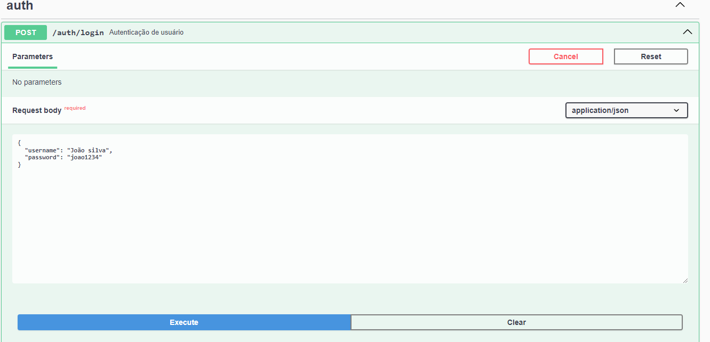
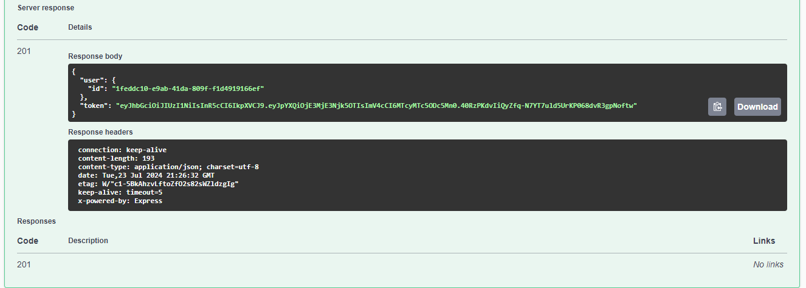
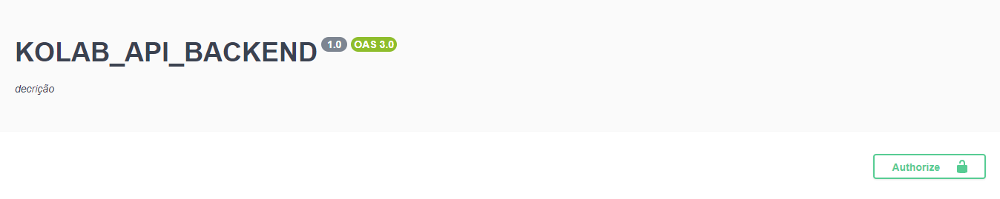
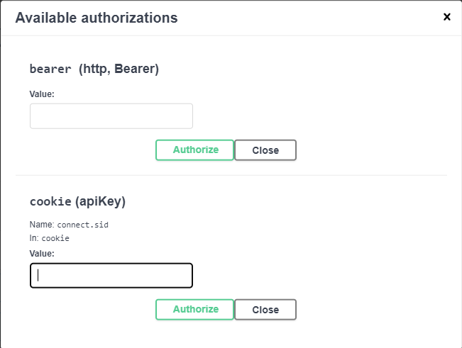
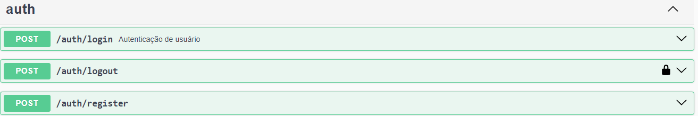
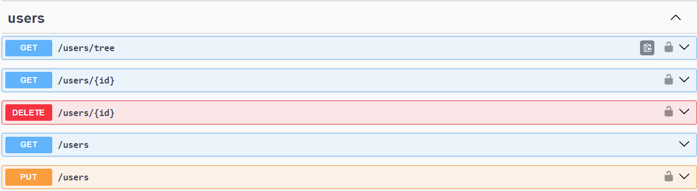

# PROJETO API KOLAB BACKEND


Esse projeto é um api desenvolvida para meios de avaliação em processo seletivo, nele você encotrará funcionalidades para autenticação de usuários e acesso a endpoints protegidos.

### REQUISITOS

Antes de rodar a API, certifique-se de que você tem os seguintes requisitos instalados

• Node.js (versão 14.x ou superior, preferencialmente a LTS)

• NPM ou gerenciador de pacotes de sua escolha.

• Banco de dados (Por exemplo MYSQL ou POSTGRESQL)

## Configuração do ambiente

#### 1. Clone o repositório

```bash
git clone https://github.com/Caique-LF/KOLAB_API.git
```

#### 2. Instale as dependências

```bash
npm install
```

#### 3. Configure as variaveis de ambiente em um arquivo .env na raiz do projeto

```bash
DB_HOST=
DB_PORT=
DB_USER=
DB_NAME=
DB_PASSWORD=

JWT_SECRET=
```

## RODAR O PROJETO

#### 1. Inicie o servidor

```bash
npm run start
```

ou para desenvolvimento com automatic reload

```bash
npm run start:dev
```

## AUTENTICAÇÃO

### Registro de Usuário

Para registrar um novo usuário, envie um POST para o endpoint `/auth/register` com o corpo da requisição como objeto json com o seguinte formato:

```json
{
  "username": "João silva",
  "password": "jao1234"
}
```

Você também pode informar o idenitificador do superior(pai) caso tenha interesse de obter a arvore hierarquica.

```json
{
  "username": "João silva",
  "password": "joa01234",
  "parentUserId": "id do superior aqui"
}
```

### Login de Usuário

Para autenticar o usuário e obter um token JWT, envie um POST para o endpoint `/auth/login` com o corpo da requisição como objeto json no seguinte formato:

```json
{
  "username": "João silva",
  "password": "joao1234"
}
```



Caso a autenticação seja bem sucedida você receberá um token no corpo da requisição esse token será persistido automaticamente nos cookies do se navegador.



### Utilização dos endpoint protegidos

Supondo que você logou com sucesso e obteve o token no corpor da requisição, você poderá acessar o endpoints protegidos.

Para isso é nescessário que inclua o token no cabeçalho `Authorization` da sua requisição com o prefixo `Bearer`.

```bash
curl -X GET http://localhost:3000/users/tree\
  -H "Authorization: Bearer YOUR_JWT_TOKEN"

```

Caso esteja usando o swagger clique em `Authorize`



Logo em seguida clique no campo `cookie` e ensira o token.



## Como as Rotas estão estruturadas

Aqui estão as rotas disponíveis na API:

### **Autenticação**



- **POST /auth/login**

  - **Descrição:** Autentica o usuário e retorna um token JWT.
  - **Corpo da Requisição:**
    ```json
    {
      "username": "string",
      "password": "string"
    }
    ```
  - **Resposta de Sucesso:**
    ```json
    {
      "user": {
        "id": "string"
      },
      "token": "string"
    }
    ```
  - **Resposta de Erro:**
    ```json
    {
      "statusCode": 401,
      "message": "Nome de usuário ou senha incorreta."
    }
    ```

- **POST /auth/register**
  - **Descrição:** Registra um novo usuário.
  - **Corpo da Requisição:**
    ```json
    {
      "username": "string",
      "password": "string",
      "parentUserId": "string" // Opcional
    }
    ```
  - **Resposta de Sucesso:**
    ```json
    {
      "id": "string",
      "username": "string",
      "parentUserId": "string" // Opcional
    }
    ```
  - **Resposta de Erro:**
    ```json
    {
      "statusCode": 400,
      "message": "Nome de usuário já em uso. Por favor tente outro."
    }
    ```

### **Usuários**



- **GET /users**

  - **Descrição:** Retorna uma lista de usuários.
  - **Resposta de Sucesso:**
    ```json
    [
      {
        "id": "string",
        "username": "string",
        "parentUserId": "string" // Opcional
      }
    ]
    ```

- **GET /users/:id**

  - **Descrição:** Retorna um usuário específico.
  - **Resposta de Sucesso:**
    ```json
    {
      "id": "string",
      "username": "string",
      "parentUserId": "string" // Opcional
    }
    ```
  - **Resposta de Erro:**
    ```json
    {
      "statusCode": 404,
      "message": "Usuário não encontrado"
    }
    ```

- **PUT /users/:id**

  - **Descrição:** Atualiza um usuário existente.
  - **Corpo da Requisição:**
    ```json
    {
      "username": "string",
      "password": "string",
      "parentUserId": "string" // Opcional
    }
    ```
  - **Resposta de Sucesso:**
    ```json
    {
      "id": "string",
      "username": "string",
      "parentUserId": "string" // Opcional
    }
    ```
  - **Resposta de Erro:**
    ```json
    {
      "statusCode": 404,
      "message": "Usuário não encontrado"
    }
    ```

- **DELETE /users/:id**

  - **Descrição:** Remove um usuário específico.
  - **Resposta de Sucesso:**
    ```json
    {
      "statusCode": 204,
      "message": "Usuário deletado com sucesso"
    }
    ```
  - **Resposta de Erro:**

    ```json
    {
      "statusCode": 404,
      "message": "Usuário não encontrado"
    }
    ```

    **GET /users/tree**

  - **Descrição:** Retorna um objeto json contendo um array com a arvore hierarquica.
  - **Resposta de Sucesso:**
    ```json
    {
       [
        {
            "id": "string",
            "username": "string",
            "parentUserId": "string",
            "children" : []
        }
      ]
    }
    ```
  - **Resposta de Erro:**
    ```json
    {
      "statusCode": 404,
      "message": "Usuário não encontrado"
    }
    ```

## Como os diretorios estão estruturados

• `src/`: Código fonte da aplicação.

• `src/auth/`: Módulo responsável pela autenticação de usuários.

• `src/users/`: Módulo para gerenciamento de usuários.

• `src/migrations`: Scripts de migration do banco de dados.(Implementação futura)

## Tecnologias usadas no projeto

- [NestJS](https://nestjs.com/)
- [TypeScript](https://www.typescriptlang.org/)
- [TypeORM](https://typeorm.io/)
- [MySQL](https://www.mysql.com/)
- [JWT](https://jwt.io/)
- [bcrypt](https://www.npmjs.com/package/bcrypt)
- [Swagger](https://swagger.io/)

## Documentação Adicional

- [Documentação do MySQL](https://dev.mysql.com/doc/)
- [Guia de Introdução ao NestJS](https://docs.nestjs.com/)
- [Documentação do TypeORM](https://typeorm.io/)
- [Guia de Uso do TypeScript](https://www.typescriptlang.org/docs/)
- [JWT Authentication](https://jwt.io/introduction/)
- [Documentação do bcrypt](https://www.npmjs.com/package/bcrypt)
- [Documentação do Swagger](https://swagger.io/docs/)

Cada uma dessas tecnologias contribui para a criação de uma aplicação robusta, segura e fácil de manter.
